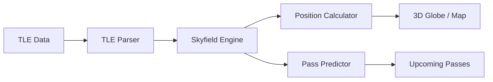

# SatelliteTracker

**Real-time Satellite Tracking and Orbit Prediction System**

[](https://www.python.org/)
[](LICENSE)
[](https://github.com/mehmetd7mir/SatelliteTracker/actions)

> Track satellites in real-time, predict passes, and visualize orbits on a 3D globe.

---

## Features

- Real-time satellite position tracking using [Skyfield](https://rhodesmill.org/skyfield/)
- TLE (Two-Line Element) data parsing from CelesTrak
- Orbit prediction and ground track calculation
- Pass prediction for any observer location
- Interactive 3D Earth visualization with Plotly
- Support for ISS, Starlink, GPS, and custom satellites
- Offline mode with sample TLE data

## How It Works



1. **TLE Data** is fetched from CelesTrak (or loaded from file)
2. **TLE Parser** extracts orbital elements (inclination, eccentricity, mean motion, etc.)
3. **Skyfield** propagates the orbit and calculates satellite position at any time
4. **Results** are shown as coordinates, ground tracks, or 3D visualizations

## Quick Start

```bash
# install dependencies
pip install -r requirements.txt

# track ISS (needs internet for TLE data)
python main.py --satellite ISS

# offline mode (uses sample data)
python main.py --satellite ISS --offline

# show upcoming passes over Istanbul
python main.py --satellite ISS --passes --lat 41.0 --lon 29.0

# 3D visualization
python main.py --satellite ISS --visualize --offline

# list available categories
python main.py --list
```

### Example Output

```
==================================================
  SatelliteTracker
  Real-time Satellite Tracking System
==================================================

[INFO] Using offline sample data...
[OK] Loaded 3 satellites

Tracking: ISS (ZARYA)
NORAD ID: 25544

Current Position:
  Latitude:  -23.4521 deg
  Longitude: 134.2187 deg
  Altitude:  419.83 km
  Velocity:  7.66 km/s
  Sunlit:    Yes
  Time:      2025-11-20 14:30:00 UTC
```

## Project Structure

```
SatelliteTracker/
├── main.py                 # entry point
├── src/
│   ├── tracking/
│   │   ├── tle_parser.py          # TLE data parsing
│   │   └── satellite_tracker.py   # position calculation
│   ├── prediction/
│   │   └── pass_predictor.py      # pass prediction
│   └── visualization/
│       └── globe.py               # 3D globe with Plotly
├── tests/                  # unit tests
├── data/                   # sample TLE files
├── docs/                   # documentation
└── .github/workflows/      # CI pipeline
```

## Running Tests

```bash
pip install pytest
pytest tests/ -v
```

## Tech Stack

| Component | Technology |
|-----------|------------|
| **Orbit Calculation** | Skyfield |
| **Data Processing** | NumPy, Pandas |
| **3D Visualization** | Plotly |
| **Web Dashboard** | Streamlit |
| **TLE Source** | CelesTrak API |

## Key Concepts

- **TLE (Two-Line Element)**: Standard format for satellite orbit data. Contains orbital parameters like inclination, eccentricity, and mean motion
- **Pass**: When a satellite rises above the horizon from an observer location, reaches maximum elevation, and sets again
- **Ground Track**: The path a satellite traces on Earth's surface

## Author

**Mehmet Demir** - [GitHub](https://github.com/mehmetd7mir)
